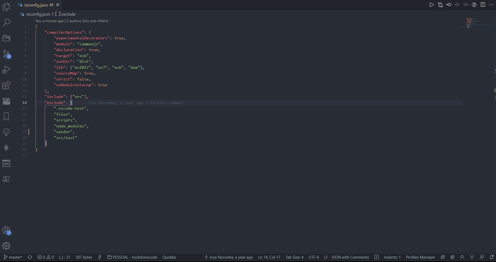
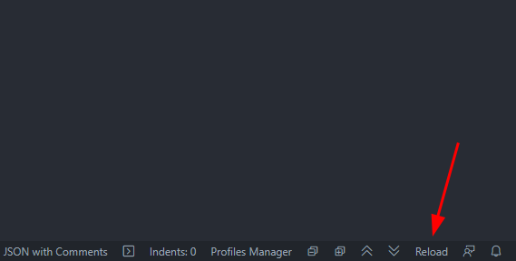
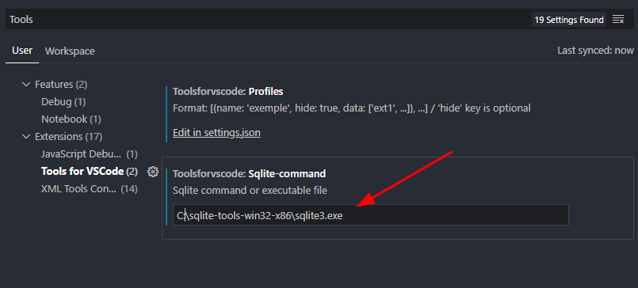
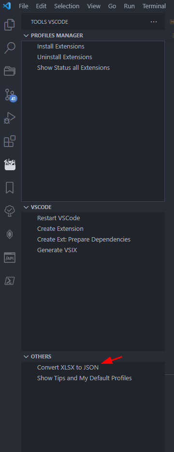

# Tools For Vscode

With this extension, you can:
- Collapse/Expand



- Reload



- Enable/Disable
  
1. You need to install sqlite or download [binary](https://www.sqlite.org/download.html) and insert path of binary going to settings and follow:



2. After set config with profiles, its necessary to `restart` vscode and then you can enable/disable extensions.

```json
[
    {
        "name": "Profile Name Example",
        // "hide" key is optional
        // When set true, this profile not appear on profile menu
        // All extensions on this profile will be always enabled
        "hide": true,
        "data": [
            "extension-id-1",
            "extension-id-2",
            ...
        ]
    },
    ...
]
```


- Install/Uninstall

Install/Uninstall all extension defined on profiles settings

- Convert `XLSX` to `JSON`


